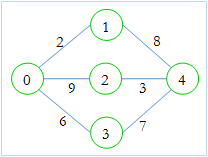

# LOJ 1002 - Country Roads 
---

I am going to my home. There are many cities and many bi-directional roads between them. The cities are numbered from 0 to n-1 and each road has a cost. There are m roads. You are given the number of my city t where I belong. Now from each city you have to find the minimum cost to go to my city. The cost is defined by the cost of the maximum road you have used to go to my city.



For example, in the above picture, if we want to go from 0 to 4, then we can choose

    0 - 1 - 4 which costs 8, as 8 (1 - 4) is the maximum road we used
    0 - 2 - 4 which costs 9, as 9 (0 - 2) is the maximum road we used
    0 - 3 - 4 which costs 7, as 7 (3 - 4) is the maximum road we used

So, our result is 7, as we can use 0 - 3 - 4.

### Input

Input starts with an integer _T (≤ 20)_, denoting the number of test cases.

Each case starts with a blank line and two integers _n (1 ≤ n ≤ 500)_ and _m (0 ≤ m ≤ 16000)_. The next _m_ lines, each will contain three integers _u, v, w (0 ≤ u, v < n, u ≠ v, 1 ≤ w ≤ 20000)_ indicating that there is a road between _u_ and _v_ with cost _w_. Then there will be a single integer _t (0 ≤ t < n)_. There can be multiple roads between two cities.

### Output

For each case, print the case number first. Then for all the cities (from 0 to n-1) you have to print the cost. If there is no such path, print Impossible.


### Helpful Resources

* [Graph (abstract data type)](https://en.wikipedia.org/wiki/Graph_(abstract_data_type) "Graph (abstract data type) - WikiPedia")

* [Dijkstra's algorithm](https://en.wikipedia.org/wiki/Dijkstra%27s_algorithm "Dijkstra's algorithm - WikiPedia")

* [Dijkstra’s shortest path algorithm - GeeksForGeeks](https://www.geeksforgeeks.org/dijkstras-shortest-path-algorithm-greedy-algo-7/https://www.geeksforgeeks.org/dijkstras-shortest-path-algorithm-greedy-algo-7/ "Dijkstra’s shortest path algorithm | Greedy Algo-7")

* [Abdul Bari's Explanation of Dijsktra (Video)](https://www.youtube.com/watch?v=XB4MIexjvY0 "Abdul Bari's Explanation of Dijsktra - YouTube")


## Solution

At first we will simply create a _graph_ structure for the _Area Map_ in any preferred method (adj. matrix/ linked list). The problem statement has confirmed : (1) there shall be no negative cost for the roads and (2) the graph is a _bi-directional_/_undirected graph_. We can apply _Dijsktra's Algorihtm_ or its derivative or any similar. The problem statement has stated that there are __multiple source nodes__, the other cities expect home town, and actually the __destination node__ is the __home town__.But for ease of implementation we will consider the __home town__ as the __source node__ and the _other cities_ as the __destination nodes__, meaning it's not about finding the shortest path for _traversing all the cities in one go in one single optimal path_ rather it's about finding _multiple optimal path for each individual city by traversing multiple path_. Thus instead of being __greedy__, we go full __brute force__ by not leaving any route for a single _city_ to _home town_ untried. More clearly, we won't be marking any _city_ for being traversed previously. We must implement in such way that we have to keep the _distance_ _array_/_list_ for keeping record of the _minimum of the highest road cost (weight)_ encountered while traversing through a specific route for a specific destination instead of _summing_ each _weight_ encountered and taking the _minimum sum_. 
 `optimal path of a city to the home town = path that has the minimum highest weighted road among all possible routing`. (Look through the code for better understanding.)

__Caution__ : Remember to use fast I/O for your preferred language as per the suggestion from the problem statement and find out what may disrupt them to avoid it. 

The above implementation is `accepted`.

## Solution in C++ 
```cpp

#include <bits/stdc++.h>
using namespace std;

int main()
{
    //Enabling fast I/O for Cpp. Don't use anything that disrupts fast I/O (For example: `endl`).
    ios::sync_with_stdio(false);
    cin.tie(NULL);
    cout.tie(NULL);

    int testCases, numberOfCities, numberOfRoads,
        sourceCity, destinationCity, roadCost, homeTown, maxCostFound;
    /*
    sourceCity = edge's first endpoint 
    destinationCity = edge's second endpoint 
    homeTown = source node from where we traverse
          
    */

    cin >> testCases;

    for (int i = 1; i <= testCases; i++)
    {
        cin >> numberOfCities >> numberOfRoads;

        vector<int> areaMap[numberOfCities];      //actual graph 
        int distanceFromHomeTown[numberOfCities]; //distance output array
        int cost[numberOfCities][numberOfCities]; //road costs

        memset(cost, 0, sizeof(cost)); //initially setting the costs as not specified
        for (int i = 0; i <= numberOfCities; i++)
            distanceFromHomeTown[i] = INT_MAX;

        //Adding each given roads while checking if already a low cost road exist between them or not
        for (int i = 0; i < numberOfRoads; i++)
        {
            cin >> sourceCity >> destinationCity >> roadCost;

            if (cost[sourceCity][destinationCity]) //checking any previous road exists or not
            {
                cost[sourceCity][destinationCity] = cost[destinationCity][sourceCity] = min(cost[sourceCity][destinationCity], roadCost);
            }
            else
            {
                //adding new road
                areaMap[sourceCity].push_back(destinationCity);
                areaMap[destinationCity].push_back(sourceCity);
                cost[sourceCity][destinationCity] = cost[destinationCity][sourceCity] = roadCost;
            }
        }

        cin >> homeTown;

        queue<int> cityQueue; //making a queue to traverse through each of the city

        cityQueue.push(homeTown); //pushing the home town as our start point or source node 

        distanceFromHomeTown[homeTown] = 0;

        while (!cityQueue.empty())
        {

            
            int startingCity = cityQueue.front();

            cityQueue.pop(); //taking it out since it will be traversed now

            //Checking the other cities that can be reached via startingCity

            /* 
            don't sum previous road costs.
            as per problem requirement, we only update distance by maximum weight encountered.
            don't check for duplicate enqueueing as we may find a better path that has less max value.
            we need to go full brute force leaving no path unchecked because of the problem requirements.
            */

            for (int i = 0; i < areaMap[startingCity].size(); i++)
            {
                int currentCity = areaMap[startingCity][i];
                maxCostFound = max(distanceFromHomeTown[startingCity],
                                   cost[startingCity][currentCity]);
                if (distanceFromHomeTown[currentCity] > maxCostFound)
                {
                    distanceFromHomeTown[currentCity] = maxCostFound;
                    cityQueue.push(currentCity); 
                }
            }
        }

        cout << "Case " << i << ":\n";
        for (int i = 0; i < numberOfCities; i++)
            if (distanceFromHomeTown[i] == INT_MAX)
                cout << "Impossible\n";
            else
                cout << distanceFromHomeTown[i] << "\n";
    }

    return 0;
}


```
