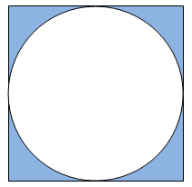
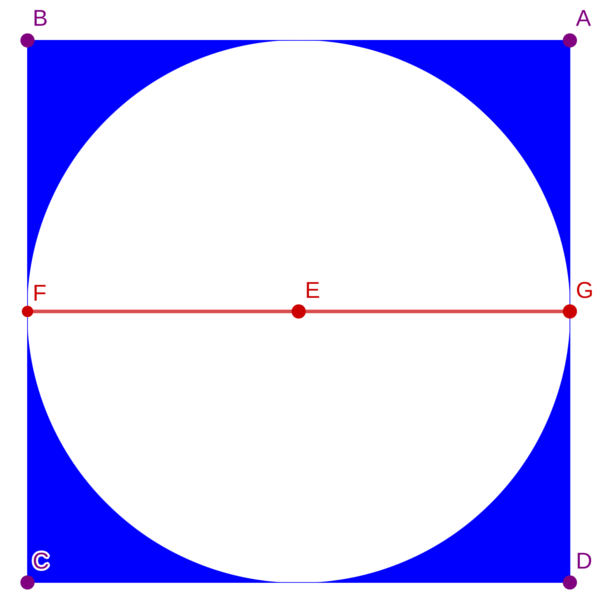

# LOJ 1022 - Circle in Square #
---
A circle is placed perfectly into a square. The term perfectly placed means that each side of the square is touched by the circle, but the circle doesn't have any overlapping part with the square. See the picture below.

<p align="center"></p>

Now you are given the radius of the circle. You have to find the area of the shaded region (blue part). Assume that `pi = 2 * acos (0.0)` (acos means cos inverse).

### Input ###

Input starts with an integer _T (≤ 1000)_, denoting the number of test cases.

Each case contains a floating point number _r (0 < r ≤ 1000)_ denoting the radius of the circle. __And you can assume that _r_ contains at most four digits after the decimal point__.

### Output ###

For each case, print the case number and the shaded area rounded to two places after the decimal point.

## Solution ##

<p align="center"></p>

We know that the `area of a square = (length of any side)²` and the `area of a circle = π*(radius)²`. Here the `length of any side of the square = 2*radius of the circle`. We can easily calculate the `area of the blue part` 

```
 area of the blue part = area of the square - area of the circle
                       = (2*r)² - π*r²
```
The above implementation is `accepted`.


## Solution in C ##

```c
#include <stdio.h>
#include <math.h>

int main()
{
    int t;
    double pi = 2.0 * acos(0.0);
    scanf("%d", &t);
    for (int i = 1; i <= t; i++)
    {
        double r;
        scanf("%lf", &r);
        double area = (2 * r * 2 * r) - (pi * r * r);
        printf("Case %d: %.2lf\n", i, area);
    }
    return 0;
}
```