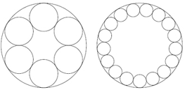
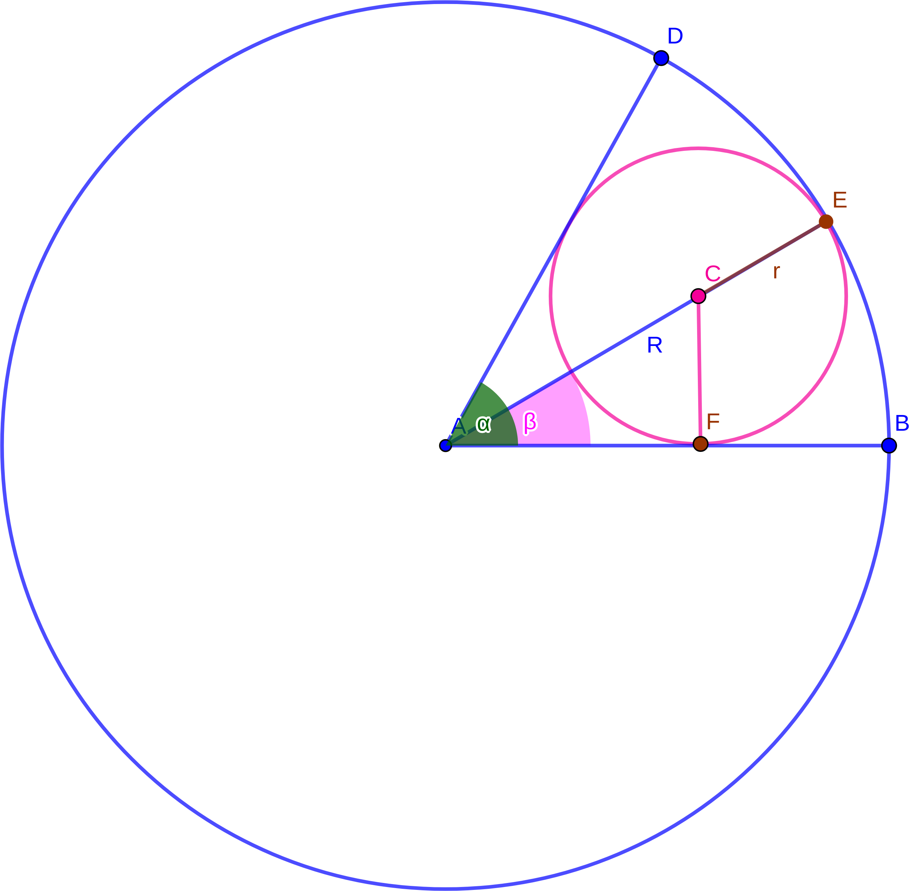

# LOJ 1072 - Calm Down #
---
George B. wants to be more than just a good American. He wants to make his daddy proud and become a hero. You know, like Shakib Khan.

But sneaky as he is, he wants a special revolver that will allow him to shoot more often than just the usual six times. This way he can fool and kill the enemy easily (at least that's what he thinks, and that's the best he can think). George has kidnapped . . . uh, I mean . . ."invited" you and will only let you go if you help him with the math. The piece of the revolver that contains the bullets looks like this (examples for 6 and 17 bullets):

<p align="center"></p>

There is a large circle with radius R and n little circles each having radius r, are placed inside on the border of the large circle. George wants his bullets to be as large as possible, so there should be no space between the circles. George will decide how large the whole revolver will be and how many bullets it shall contain. Your job is, given R and n, to compute r. You have decided to help, because you know that he can't make a revolver even if you help him with the math.


### Input

Input starts with an integer _T (≤ 125)_, denoting the number of test cases.

Each case contains a real number _R (0 < R < 1000)_ and contains up to at most two places after the decimal point and an integer _n (2 ≤ n ≤ 100)_.

### Output

For each test case, print the _case number_ and _r_ in a single line. __Errors less than 10-6 will be ignored.__


## Solution ##

<p align="center"></p>

If we look at the picture above, we can see that a *smaller circle* within the *bigger circle* creates an **angle** `α` if we draw two **tangent line**s starting from the *bigger circle*'s **center** `A` on the two sides of the *smaller circle* touching the *bigger circle*'s **parameter line** which are`AD` and `AB` respectively. We know a circle produces an **angle** of `2*π`. And the *smaller circles* do not have any space among themselves, so `2*π = N*α` from which, we can get `α = 2π/N`. 

Also let's draw `AE` which goes through the **center** of the *small circle* `c` and here `AE = R (radius of the bigger circle) = AD = AB`. Drawing `AE` produces an **angle** `β`. Since the *smaller circle* is split straight through its **center**, `β = α/2` from which we can get `β = (2*π/N)/2 = π/N`.

Now let's draw one **perpendicular line** from **point** `C` on `AB` which is `CF`. If we observe the figure, `CF = CE = r (radius of the smaller circle)`. Now we can easily find out the value of `r` using the `sin(β)` ratio.

```
    sin(β) = CF/(AE-CE) 
           = r/(R-r)
=>  sin(π/N) = r/(R-r)
=>  r = sin(π/N)*(R-r)
      = sin(π/N)*R - sin(π/N)*r
=>  r + sin(π/N)*r = sin(π/N)*R
=>  r*(1+ sin(π/N)) = sin(π/N)*R
=>  r = sin(π/N)*R/(1+ sin(π/N))

```
So, `r = sin(π/N)*R/(1+ sin(π/N))`.

The above implementation is `Accepted`.

## Solution in C ##

```c
#include <stdio.h>
#include <math.h>
int main()
{

    int cases;
    scanf("%d", &cases);
    double pi = 2 * acos(0.0);
    for (int i = 1; i <= cases; i++)
    {
        double R;
        int n;
        scanf("%lf %d", &R, &n);
        double r = (R * sin(pi / n * 1.0)) / (1 + sin(pi / n * 1.0));
        printf("Case %d: %.10lf\n", i, r);
    }
    return 0;
}
```