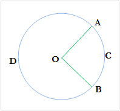

# LOJ 1433 - Minimum Arc Distance
---
You all probably know how to calculate the distance between two points in two dimensional cartesian plane. But in this problem you have to find the minimum arc distance between two points and they are on a circle centered at another point.

You will be given the _co-ordinates_ of the points __A__ and __B__ and _co-ordinate_ of the center __O__. You just have to calculate the minimum _arc distance_ between __A__ and __B__. In the picture, you have to calculate the _length_ of _arc_ __ACB__. You can assume that __A__ and __B__ will always be on the circle centered at __O__.

<p align = "center"></p>

### Input

Input starts with an integer _T (≤ 100)_, denoting the number of test cases.

Each case starts with a line containing six integers O<sub>x</sub>, O<sub>y</sub>, A<sub>x</sub>, A<sub>y</sub>, B<sub>x</sub>, By where (O<sub>x</sub>, O<sub>y</sub>) indicates the co-ordinate of O, (A<sub>x</sub>, A<sub>y</sub>) denote the co-ordinate of A and (B<sub>x</sub>, B<sub>y</sub>) denote the co-ordinate of B. All the integers will lie in the range [1, 10000].

### Output

For each case, print the case number and the minimum arc distance. Errors less than 10<sup>-3</sup> will be ignored.

## Solution


To solve it, we first must remember the formula to calculate the [arc length](https://en.wikipedia.org/wiki/Arc_length "arc length") between 2 points of a __circle__, which is 
```
arc length = (radius of the circle) * (angle created by the 2 points at the center of the circle, in radian)
```

To understand this formula in a quick look or to refresh our memories, we can see that the _arc length_ is proportional to the __θ__,_angle created at the center of a circle_. The bigger the _arc length_, the bigger becomes the _angle_ in between the 2 points of the cirlce and vice versa. We can see that the __Circumference__ is the longest arc length of a circle, also we know __C = 2 * π * (radius of the cirlce)__. 
```
C is the arc length when θ = 2 * π
1 is the arc length when θ = (2 * π)/C
                           = (2 * π)/(2 * π *r)
                           = 1/r
S is the arc length when θ = S/r

So, S = θ * r
```

We can calculate the radius of the circle simply by taking the _distance_ of any _point of a circle_ to its _center_, __distance = √((P1<sub>x</sub> - P2<sub>x</sub>)² + (P1<sub>y</sub> - P2<sub>y</sub>)²)__.

Now to calculate the _angle_ we can use the _cosine rule_ of triangles,
```
AB (Straight line, not the arc length) = √(OA²+OB²-2*OA*OB*cosθ)  
=> AB²  = OA²+OB²-2*OA*OB*cosθ
=> cosθ = (OA²+OB²-AB²)/2*OA*OB
=> θ = arccos ((OA²+OB²-AB²)/2*OA*OB)
```
We again use the _distance_ formula for each line and now we have the necessary values that we can plug into the _arc length_ formula.

The above implementation is `accepted`.

## Solution in C
```c
#include <stdio.h>
#include <math.h>

int main()
{
    int testCases, ox, oy, ax, ay, bx, by;
    scanf("%d", &testCases);
    double OA, OB, AB, angle;
    for (int i = 1; i <= testCases; i++)
    {
        scanf("%d %d %d %d %d %d", &ox, &oy, &ax, &ay, &bx, &by);

        OA = sqrt(pow(ax - ox, 2) + pow(ay - oy, 2));
        OB = sqrt(pow(bx - ox, 2) + pow(by - oy, 2));
        AB = sqrt(pow(ax - bx, 2) + pow(ay - by, 2));

        angle = acos((pow(OA, 2) + pow(OB, 2) - pow(AB, 2)) / (2 * OA * OB));

        printf("Case %d: %.3lf\n", i, OA * angle);
    }
    return 0;
}

```