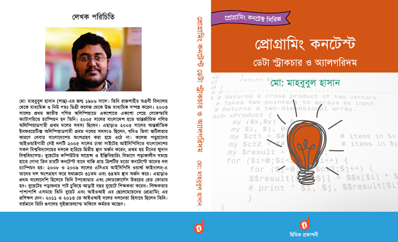

# Programming Contest: Data Structure & Algorithm by Md. Mahbubul Hasan (June, 2016) #
---

This repo contains solutions to the problems and exercises provided in __প্রোগ্রামিং কন্টেস্ট : ডেটা স্ট্রাকচার ও অ্যালগরিদম__ by __মোঃ মাহবুবুল হাসান__ (2016). You are highly discouraged to look through the solutions without trying out a problem by yourself first.

## Guidelines for Contributor

You are more than welcome to contribute and fix. Do standard `issue` > `branch out` > `pull request`.
* Accepted programming languages : `Haskell`, `Java`, `C`, `C++`, `C#`, `Python`, `Go`, `JavaScript` and `Rust`.
* Explanation languages : `English` and `Bengali`.
* Explanation document : `PDF` and `Markdown`

Please raise an `issue` first then do a `pull request` later upon implementing it. Your unresponded `issue` will be closed after `30` days if you are unavailable.

Coding guidelines:

* __USE PROPER VARIABLE/FUNCTION/METHOD NAMING__.
* Do proper indentation.
* Add comments so that people can relate to the explanations.
* Follow the standards of your language.
* If you are using a data structure specific to your language, mention the `insertion`/`deletion`/`mutation`/`look up`/`prepend`/`append` costs.
* Include the driver code in the same file.

## Disclaimer

[LightOJ](https://lightoj.com/home), [Codeforces](https://codeforces.com/), [Timus](https://acm.timus.ru/), [UVa](https://onlinejudge.org/), [Codechef](https://www.codechef.com/) and other online judges have their own copyright and agreements. Go through them if you want to copy any content directly from them.

---
If you have any queries or want to get in touch with me, you can open a `Discussion` or simply `mail` me at `showrav.ansary.bd@gmail.com` or give me a knock at .
