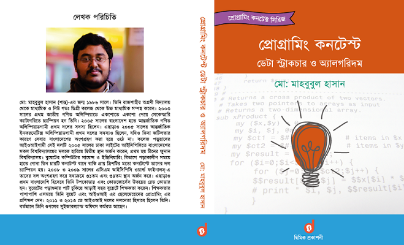

# Programming Contest: Data Structure & Algorithm by Md. MahbubulHasan (June, 2016) #
---

This repo contains solutions to the problems and exercises provided in __প্রোগ্রামিং কন্টেস্ট : ডেটা স্ট্রাকচার ও অ্যালগরিদম__ by __মোঃ মাহবুবুল হাসান__ (2016). You are highly discouraged to look through the solutions without trying out a problem by yourself first.

You are requested to create an `issue` if you find any solution not well explained or wrong. You are expected to be language agnostic about the solutions though it will heavily be written in `C` or `C++` depending on when I wrote the solution and what was more convinient for me. You are requested to focus on explaining as much as possible.  

You are requested to create an `issue` first if you want to add any solution. You are more than welcome to create a `Pull request` if you want to add solutions of your own or want to add a new paradigm to any already existing solution. It is requested that you explain a solution as vividly as possible, as detailed as possible. You can write down pseudo code too or solution in any of your preferred language.

---
If you have any queries or want to get in touch with me, you can open a `Discussion` or simply `mail` me at `showrav.ansary.bd@gmail.com` or give me a knock at . 
